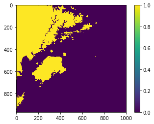

PyPros class
============

PyPros is the main class of this software as it implements the different
methodologies available to discriminate surface precipitation type using
surface observations.

In this notebook we’ll cover the parameters of PyPros class and their
format depending on the rain or snow methodology.

First of all, we’ll import PyPros class.

.. code:: python3

    import os
    os.chdir('../../')
    from pypros.pros import PyPros

``PyPros`` class receives four parameters:

-  variables_files: A list of the files paths containing the fields of
   required variables
-  method: The surface precipitation type method to use
-  threshold: The value of the threshold(s) to be used by the chosen
   method
-  data_format: A dictionary containing the order of the fields in
   variables_files

Variables_files
^^^^^^^^^^^^^^^

There are two mandatory fields to include: air temperature and dew point
temperature. Both fields allow to use all the implemented methodologies
of surface precipitation type discrimination.

Optional fields are a Digital Elevation Model (DEM) and a radar
reflectivity field. The former allows to calculate accurately the wet
bulb temperature (if this method is selected) by using altitude values.
Otherwise, wet bulb temperature is derived from air and dew point
temperature fields only. The reflectivity field allows to obtain a
masked surface precipitation type field only where precipitation is
present.

First, we’ll define the paths to each field and we’ll set
``variables_file`` with all of them.

.. code:: python3

    tair_file = './docs/notebooks/data/INT_TAIR_20170325_0030.tif'
    tdew_file = './docs/notebooks/data/INT_TDEW_20170325_0030.tif'
    dem_file = './docs/notebooks/data/DEM_CAT.tif'
    refl_file = './docs/notebooks/data/CAPPI_XRAD_20170325_0030.tif'
    
    variables_files = [tair_file, tdew_file, dem_file, refl_file]

Method and threshold
^^^^^^^^^^^^^^^^^^^^

The method is an optional parameter defaults to Koistinen and Saltikoff
method, which must be passed as ‘ks’. The following table illustrates
the different methodologies available, how they must be introduced in
``PyPros`` class and the kind of threshold required. If no threshold is
set, it assumes the default one.

+-----------------+-----------------+------------------+-----------------+
| Method          | Name            | Threshold        | Default         |
+=================+=================+==================+=================+
| Koistinen and   | ``'ks'``        | ``None``         | ``None``        |
| Saltikoff       |                 |                  |                 |
+-----------------+-----------------+------------------+-----------------+
| Air temperature | ``'static_ta'`` | ``float``        | ``0.0``         |
| static          |                 |                  |                 |
| threshold       |                 |                  |                 |
+-----------------+-----------------+------------------+-----------------+
| Wet bulb        | ``'static_tw'`` | ``float``        | ``1.5``         |
| temperature     |                 |                  |                 |
| static          |                 |                  |                 |
| threshold       |                 |                  |                 |
+-----------------+-----------------+------------------+-----------------+
| Air temperature | ``'linear_tr'`` | ``[th_l, th_u]`` | ``[0, 3]``      |
| linear          |                 |                  |                 |
| transition      |                 |                  |                 |
+-----------------+-----------------+------------------+-----------------+

Now, as an example, we’ll define wet bulb temperature static threshold
as the method to use and set threshold to 1.3\ :math:`^{\circ}`\ C.

.. code:: python3

    method = 'static_tw'
    threshold = 1.3

Data format
^^^^^^^^^^^

This parameter is a dictionary containing a key, ``vars_files``
providing the order of the fields in ``variables_files``. The name of
the variables are the following ones:

+-------------------------+------------+
| Field                   | Name       |
+=========================+============+
| Air temperature         | ``'tair'`` |
+-------------------------+------------+
| Dew point temperature   | ``'tdew'`` |
+-------------------------+------------+
| Digital Elevation Model | ``'dem'``  |
+-------------------------+------------+
| Radar reflectivity      | ``'refl'`` |
+-------------------------+------------+

Then, we’ll set ``data_format`` parameter following the
``variables_files`` order:

.. code:: python3

    data_format = {'vars_files': ['tair', 'tdew', 'dem', 'refl']}

Now we’re ready to call PyPros class and obtain a surface precipitation type field.
                                                                                   

.. code:: python3

    static_tw = PyPros(variables_files, method, threshold, data_format)

Once we’ve called the class, now we can obtain the surface precipitation
type field, apply the reflectivity mask available and save both in a
raster file.

To obtain the result, we must get the ``result`` attribute of the class.

.. code:: python3

    static_tw_field = static_tw.result

And if we want to apply the reflectivity mask, we have to call
``refl_mask`` function from the PyPros class.

.. code:: python3

    static_tw_masked = static_tw.refl_mask()

Now, we’ve obtained two fields that we can save in raster files using
``save_result`` function from PyPros class. This function receives two
parameters: the field matrix we want to save and the file path
destination.

.. code:: python3

    static_tw.save_result(static_tw_field, './docs/notebooks/output/static_tw.tif')
    static_tw.save_file(static_tw_masked, './docs/notebooks/output/static_tw_masked.tif')

We can have a look to ``static_tw`` result by plotting it with imshow:

.. code:: python3

    import matplotlib.pyplot as plt
    
    plt.imshow(static_tw.result)
    plt.colorbar()
    plt.show()

We have finished the introduction to PyPros class! Change the threshold values and the methods and see how the snow level varies!
'''''''''''''''''''''''''''''''''''''''''''''''''''''''''''''''''''''''''''''''''''''''''''''''''''''''''''''''''''''''''''''''''
