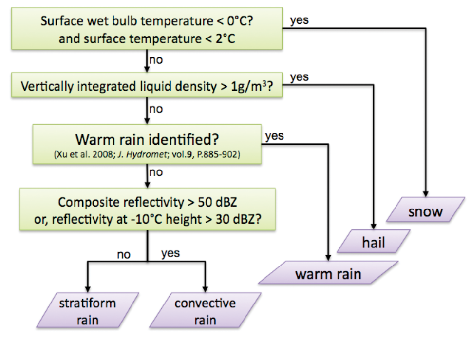

Rain or Snow
============

Knowledge of surface precipitation type can be critical during
snow events at low altitudes or in regions not used to this phenomena.
For this purpose, previous studies developed several methodologies to 
discriminate precipitation types using meteorological surface observations.
Some of them are implemented in this package.

There are different approaches to address this issue:

   - Static threshold
   - Linear transition
   - Koistinen and Saltikoff

Static threshold
----------------

A single temperature value is set as a threshold from which precipitation
type is discriminated. If temperature is above the threshold, precipitation
is classified as rain, otherwise as snow.

Air temperature (TA)
~~~~~~~~~~~~~~~~~~~~

An air temperature (:math:`T_{a}`) value is used to discriminate precipitation between rain
and snow. If precipitation occurs above the air temperature value considered,
rain is assumed. Otherwise, precipitation is classified as snow.

.. math::
   T_{a} <= T_{a_{threshold}} \longrightarrow Snow

   T_{a} > T_{a_{threshold}} \longrightarrow Rain

The best air temperature static threshold may be different depending on the
region. For more information on which is the most suitable threshold for your
area, see https://www.ncbi.nlm.nih.gov/pmc/articles/PMC5861046/.

Wet bulb temperature (TW)
~~~~~~~~~~~~~~~~~~~~~~~~~

A wet bulb temperature (:math:`T_{w}`) value is used to discriminate precipitation between rain
and snow. If precipitation occurs above the air temperature value considered,
rain is assumed. Otherwise, precipitation is classified as snow.

.. math::
   T_{w} <= T_{w_{threshold}} \longrightarrow Snow

   T_{w} > T_{w_{threshold}} \longrightarrow Rain

The best wet bulb temperature static threshold may be different depending on the
region. Still, it is common to use a wet bulb temperature value of 1.5°C.

National Mosaic and Multi-Sensor QPE System (NMQ)
~~~~~~~~~~~~~~~~~~~~~~~~~~~~~~~~~~~~~~~~~~~~~~~~~
A complete precipitation classification process is defined in the NMQ system 
(Zhang et al. 2011). However, a reduced version of it is considered in this
study. If surface temperature is less than 2°C and wet bulb temperature less
than 0°C, precipitation is in form of snow. Otherwise, the NMQ procedure
classifies precipitation as hail, warm rain, stratiform rain or convective rain.
However, in this study, distinct types of rain are not taken into account and
precipitation not categorized as snow is labelled as rain.

    Precipitation classification process of NMQ system. (Figure from Zhang et al. 2011)

#TODO implement this method

Linear transition
-----------------
Two threshold values are set to discriminate precipitation type between rain (th_r)
and snow (th_r). It can be either used with any meteorological field, but with
thresholds properly defined. If a value of the meteorological field is above th_r,
precipitation is classified as rain. On the other hand, if the values is below
th_s, precipitation is classified as snow. A linear transition is assumed for 
values between th_s and th_r, then precipitation is classified as a mixed type.

If the meteorological field chosen to discriminate air  is air temperature:

.. math::
   T_{a} <= T_{snow} \longrightarrow Snow

   T_{snow} < T_{a} < T_{rain} \longrightarrow Mixed

   T_{a} >= T_{rain} \longrightarrow Rain

Koistinen and Saltikoff (KS)
----------------------------

The methodology proposed by Koistinen and Saltikoff (1998) provides an 
empirical formula to calculate the probability of precipitation type using
temperature and relative humidity observations. Formally, the formula
calculates the probability of rain and two thresholds are set to discriminate
between snow, sleet and rain. In our case, the equation is flipped, so 
probability of snow is determined by (1) which may be expressed as

.. math::
    p(snow) = 1 - \dfrac{1}{1 + e^{22 - 2.7\cdot T - 0.2\cdot RH}}

where T corresponds to temperature in Celsius and RH to relative humidity in %.
If p(snow) obtained values are below 0.33 precipitation is in form of rain, 
if they are between 0.33 and 0.66 in form of sleet and classified as snow
if they are above 0.66.