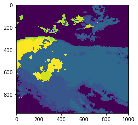
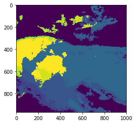
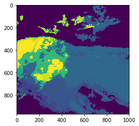
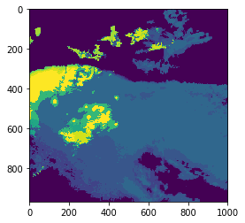

Where is it snowing?
====================

Information about surface precipitation type can be estimated
considering meteorological surface observations only. Previous studies
addressed this issue from different points of view: considering a
threshold of air temperature to discriminate precipitation type or a
combination of air temperature and relative humidity observations to get
the probability for each precipitation type: rain, sleet and snow.

In the following examples we’ll show how PyPROS classifies precipitation
considering different methodologies present in bibliography.

First of all, we’ll import the required libraries.

.. code:: ipython3

    import os
    os.chdir('../../')
    from pypros.pros import PyPros

As an example, we’ll get the precipitation type classification from
different methodologies for Catalonia on 2017-03-25 00.30 UTC. For this
purpose we’ll use an air temperature, dew point temperature, digital
elevation model (DEM) and reflectivity fields.

Those fields can be found in notebooks/data directory and we’ll keep the
path for all of them:

.. code:: ipython3

    tair_file = './docs/notebooks/data/INT_TAIR_20170325_0030.tif'
    tdew_file = './docs/notebooks/data/INT_TDEW_20170325_0030.tif'
    dem_file = './docs/notebooks/data/DEM_CAT.tif'
    refl_file = './docs/notebooks/data/CAPPI_XRAD_20170325_0030.tif'

Now, we’ll define those parameters that PyPros class uses and are the
same whether the methodology changes or not. These parameters are:
``variables_files`` and ``data_format``. For more information on this
class, see `PyPros Class <pypros_class.html>`__ notebook.

.. code:: ipython3

    variables_files = [tair_file,
                       tdew_file,
                       dem_file,
                       refl_file]
    data_format = {'vars_files':['tair', 'tdew', 'dem', 'refl']}

Static threshold
~~~~~~~~~~~~~~~~

A single meteorological variable value is set as a threshold from which
precipitation type is discriminated. If the meteorological variable
value is above the threshold, precipitation is classified as rain,
otherwise as snow.

If air temperature (:math:`T_{a}`) is chosen as meteorological variable:

.. math::

  T_{a} <= T_{a_{threshold}} \longrightarrow Snow \\
  T_{a} > T_{a_{threshold}} \longrightarrow Rain

Air temperature threshold
^^^^^^^^^^^^^^^^^^^^^^^^^

Since we want to apply a static air temperature threshold, first we’ll
define ``method`` PyPros parameter as ``'static_ta'`` and then we’ll set
the ``threshold`` parameter to 1.0\ :math:`^{\circ}`\ C.

.. code:: ipython3

    method = 'static_ta'
    threshold = 1.0

Now, we’re ready to call PyPros class!

.. code:: ipython3

    static_ta = PyPros(variables_files, method, threshold, data_format)

We can get a quicklook of the obtained field using ``plot_pros``
function:

.. code:: ipython3

    import matplotlib.pyplot as plt
    plt.imshow(static_ta.refl_mask())
    plt.show()

In addition, we can save the precipitation type field in a raster file
using ``save_file`` function:

.. code:: ipython3

    static_ta.save_file(static_ta.result, './docs/notebooks/output/static_ta.tif')

If we provided a reflectivity field, we can also apply the reflectivity
mask by using ``refl_mask`` function and save it in a raster file:

.. code:: ipython3

    static_ta_masked = static_ta.refl_mask()
    
    static_ta.save_file(static_ta_masked, './docs/notebooks/output/static_ta_masked.tif')

Wet bulb temperature threshold
^^^^^^^^^^^^^^^^^^^^^^^^^^^^^^

We want to apply a static wet bulb temperature threshold, so first we’ll
define ``method`` PyPros parameter as ``'static_tw'`` and then we’ll set
the ``threshold`` parameter to 1.5\ :math:`^{\circ}`\ C.

.. code:: ipython3

    method = 'static_tw'
    threshold = 1.5

Now, we’re ready to call PyPros class!

.. code:: ipython3

    static_tw = PyPros(variables_files, method, threshold, data_format)

We can get a quicklook of the obtained field using ``plot_pros``
function:

.. code:: ipython3

    plt.imshow(static_tw.refl_mask())
    plt.show()

In addition, we can save the precipitation type field in a raster file
using ``save_file`` function:

.. code:: ipython3

    static_tw.save_file(static_tw.result, './docs/notebooks/output/static_tw.tif')

If we provided a reflectivity field, we can also apply the reflectivity
mask by using ``refl_mask`` function and save it in a raster file:

.. code:: ipython3

    static_tw_masked = static_tw.refl_mask()
    
    static_tw.save_file(static_tw_masked, './docs/notebooks/output/static_tw_masked.tif')

Linear transition
~~~~~~~~~~~~~~~~~

Two threshold values are set to discriminate precipitation type between
rain (:math:`th_{rain}`) and snow (:math:`th_{snow}`). It can be either
used with any meteorological field, but with thresholds properly
defined. If a value of the meteorological field is above
:math:`th_{rain}`, precipitation is classified as rain. On the other
hand, if the values is below :math:`th_{snow}`, precipitation is
classified as snow. A linear transition is assumed for values between
:math:`th_{snow}` and :math:`th_{rain}`, then precipitation is
classified as a mixed type.

If the meteorological field chosen to discriminate air is air
temperature:

.. math::

  T_{a} <= T_{snow} \longrightarrow Snow \\
  T_{snow} < T_{a} < T_{rain} \longrightarrow Mixed \\
  T_{a} >= T_{rain} \longrightarrow Rain

Air temperature transition
^^^^^^^^^^^^^^^^^^^^^^^^^^

.. code:: ipython3

    method = 'linear_tr'
    threshold = [0, 3]

Now, we’re ready to call PyPros class!

.. code:: ipython3

    linear_tr = PyPros(variables_files, method, threshold, data_format)

We can get a quicklook of the obtained field using ``plot_pros``
function:

.. code:: ipython3

    plt.imshow(linear_tr.refl_mask())
    plt.show()

In addition, we can save the precipitation type field in a raster file
using ``save_file`` function:

.. code:: ipython3

    linear_tr.save_file(linear_tr.result, './docs/notebooks/output/linear_tr.tif')

If we provided a reflectivity field, we can also apply the reflectivity
mask by using ``refl_mask`` function and save it in a raster file:

.. code:: ipython3

    linear_tr_masked = linear_tr.refl_mask()
    
    linear_tr.save_file(linear_tr_masked, './docs/notebooks/output/linear_tr_masked.tif')

Koistinen and Saltikoff
~~~~~~~~~~~~~~~~~~~~~~~

The methodology proposed by Koistinen and Saltikoff (1998) provides an
empirical formula to calculate the probability of precipitation type
using temperature and relative humidity observations. Formally, the
formula calculates the probability of rain and two thresholds are set to
discriminate between snow, sleet and rain. In our case, the equation is
flipped, so probability of snow is determined by (1) which may be
expressed as

.. math::

  p(snow) = 1 - \dfrac{1}{1 + e^{22 - 2.7\cdot T - 0.2\cdot RH}}

where T corresponds to temperature in Celsius and RH to relative
humidity in %. If p(snow) obtained values are below 0.33 precipitation
is in form of rain, if they are between 0.33 and 0.66 in form of sleet
and classified as snow if they are above 0.66.

.. code:: ipython3

    method = 'ks'
    threshold = None

Now, we’re ready to call PyPros class!

.. code:: ipython3

    ks = PyPros(variables_files, method, threshold, data_format)

We can get a quicklook of the obtained field using ``plot_pros``
function:

.. code:: ipython3

    plt.imshow(ks.refl_mask())
    plt.show()

In addition, we can save the precipitation type field in a raster file
using ``save_file`` function:

.. code:: ipython3

    ks.save_file(ks.result, './docs/notebooks/output/ks.tif')

If we provided a reflectivity field, we can also apply the reflectivity
mask by using ``refl_mask`` function and save it in a raster file:

.. code:: ipython3

    ks_masked = ks.refl_mask()
    
    ks.save_file(ks_masked, './docs/notebooks/output/ks_masked.tif')
